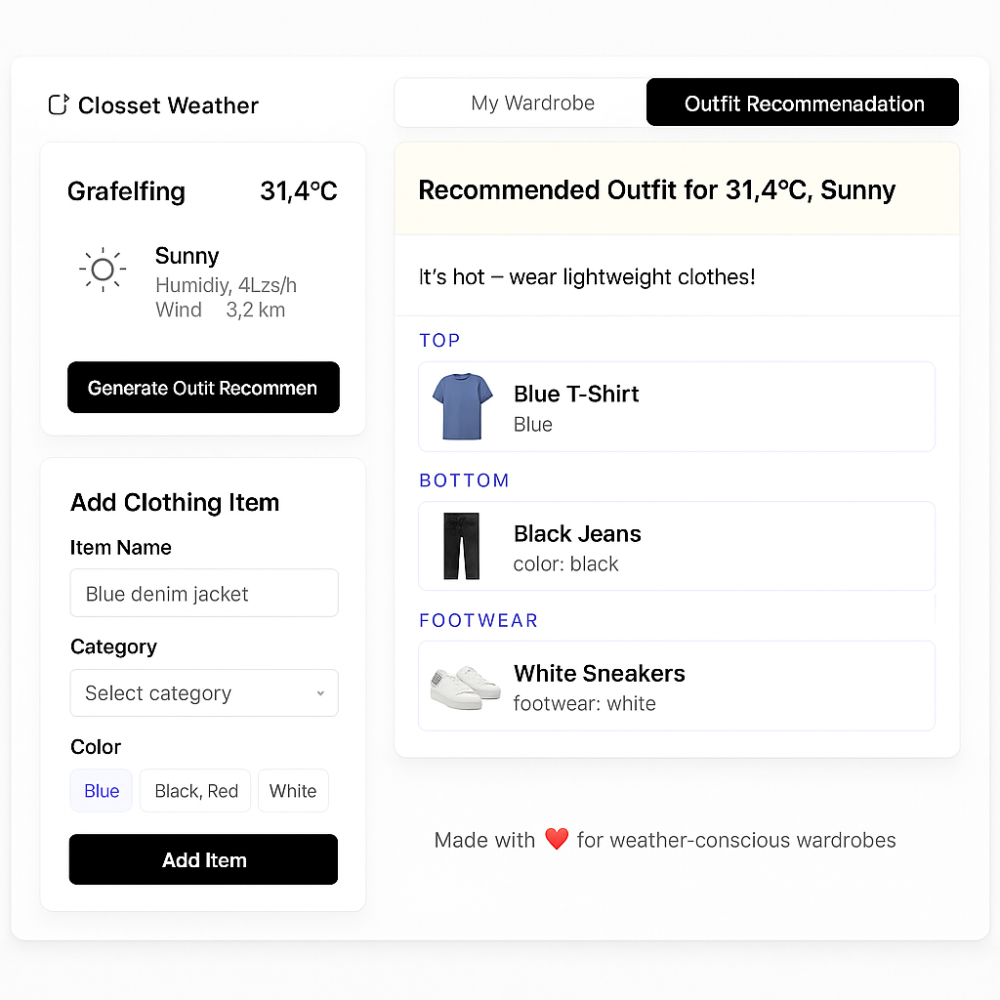

# Closet Weather Outfit AI

This is a teaser for an AI-powered web app that recommends outfits based on current weather and your personal wardrobe.

---

## Project Overview

Closet Weather Outfit AI combines live weather data with user-defined clothing items to suggest suitable outfits. The app aims to eventually include AI-generated previews of the recommended outfit on a user's photo.

Note: This is a public preview of a private project. The full implementation is not open-source at the moment. Code or demo can be shared on request.

---

## Features

- Weather-based outfit suggestions (temperature, humidity, wind)
- Custom wardrobe: add clothing items with category, color, and image
- Planned: AI-generated outfit previews based on uploaded user photos
- Simple, mobile-ready interface

---

## Tech Stack

- Frontend: React, TypeScript, Tailwind CSS
- Backend: Node.js, Express
- AI Integration: OpenAI API (image editing)
- Build Tool: Vite

---

## Screenshot

---

## Status

This repo is meant to showcase the idea and design of the project for portfolio/job application purposes.  
If you're interested in the full implementation, feel free to contact me.

---

## ❤️ Made with love for weather-conscious wardrobes
